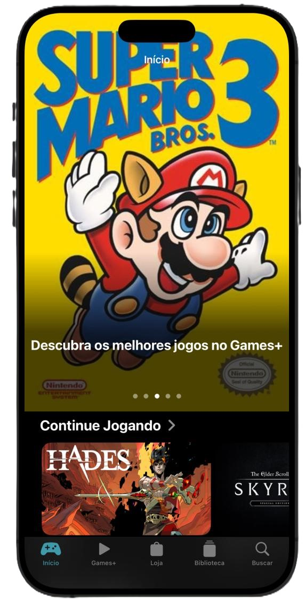
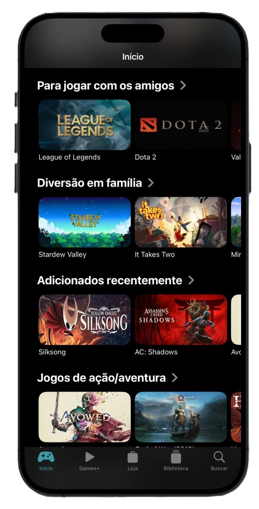
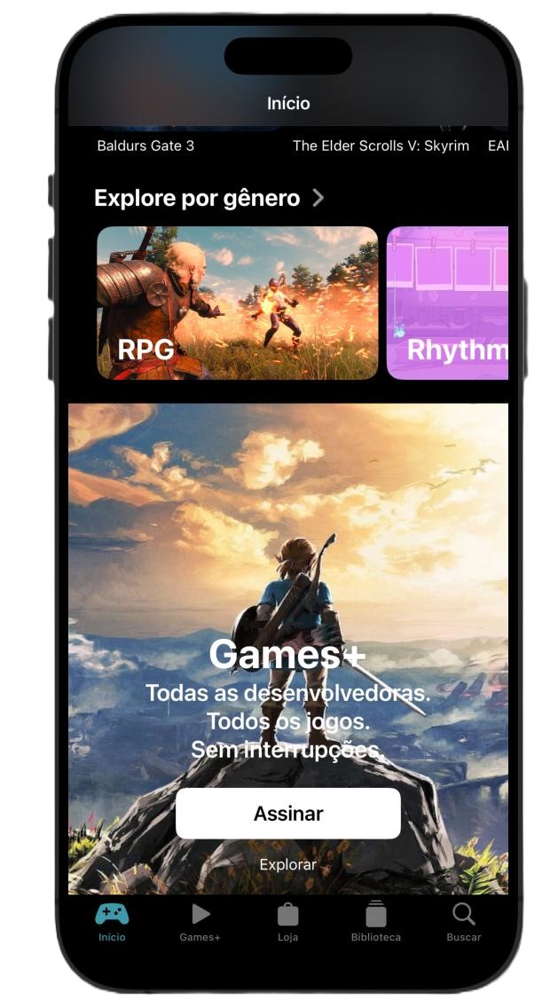
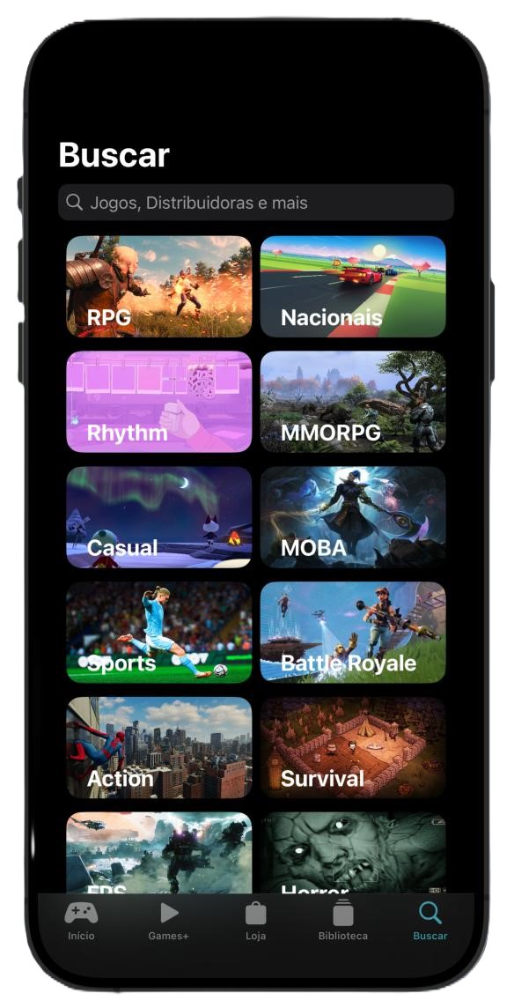

# SwiftUI_Replica
O projeto Games+ foi feito com o intuito de fazer um clone do AppleTV+, como primeiro contato com o SwiftUI, desenvolvido com a [@Tamires](https://github.com/TamiresMendesS). O app foi feito 100% com SwiftUI, não possuindo nenhuma funcionalidade, buscando apenas mudar o tema do aplicativo, que foi de séries e filmes para jogos.

## Telas

